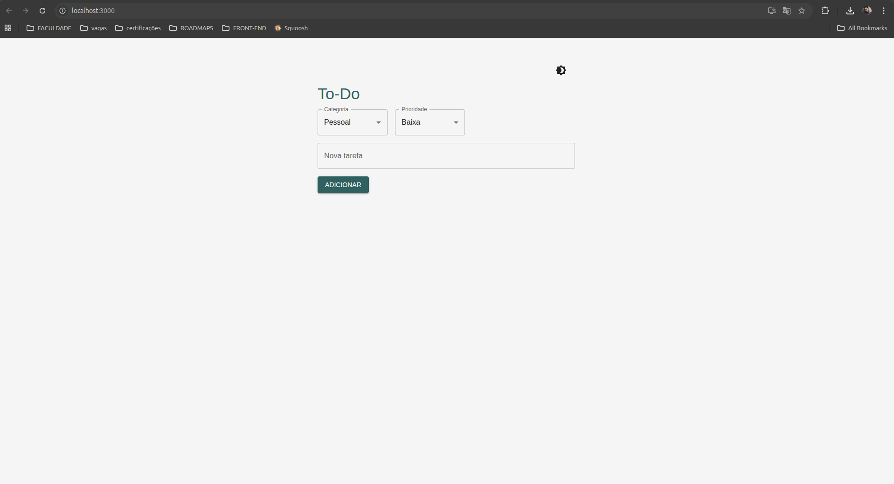
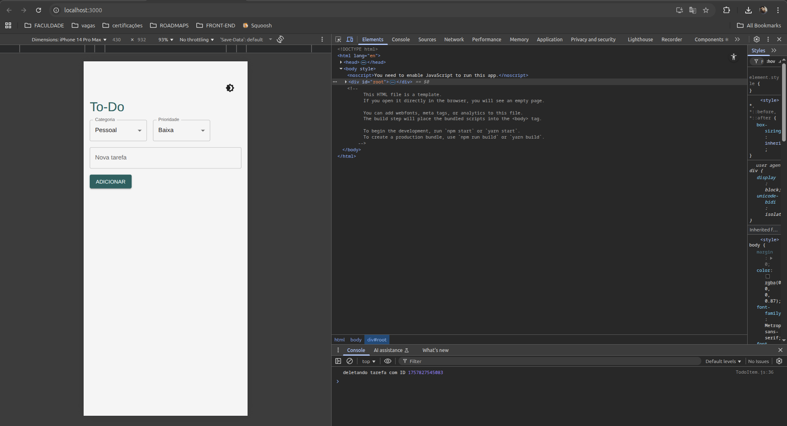
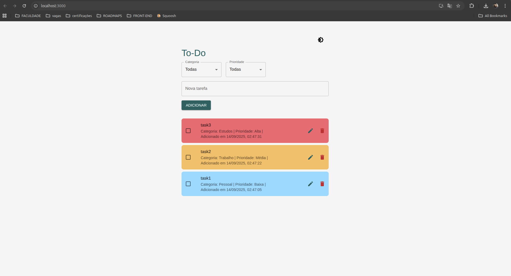
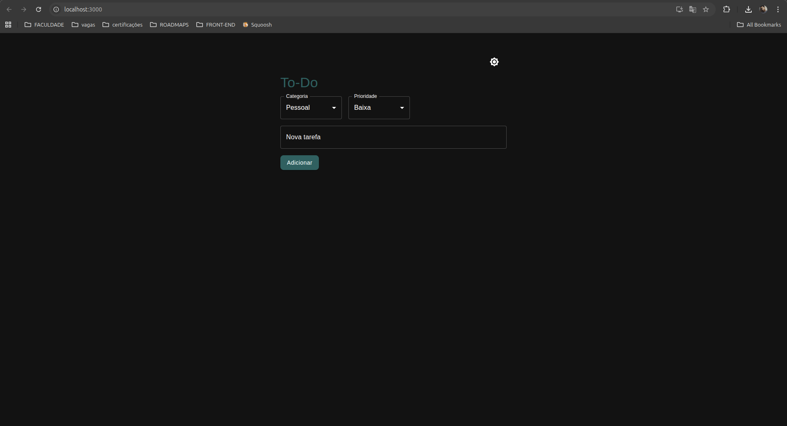
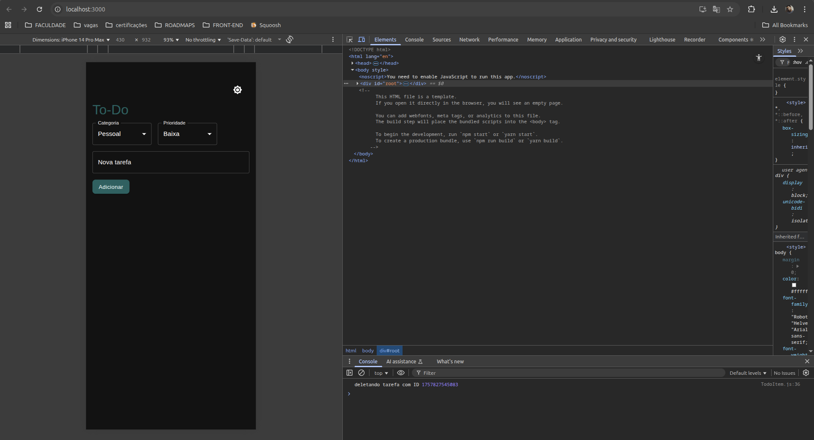
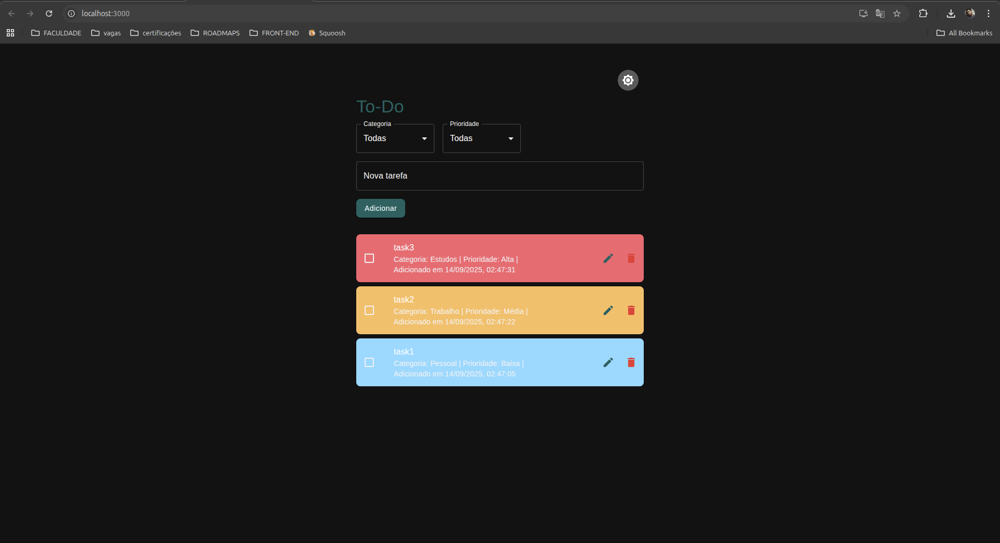

# 📝 To-Do List React + Material UI

Um gerenciador de tarefas moderno, desenvolvido com **React** e **Material UI**, com funcionalidades como **dark mode**, **categorias e prioridades**, **edição e deleção de tarefas**, e armazenamento local via **localStorage**.

---

## 🚀 Funcionalidades

- Adicionar tarefas com **categoria** e **prioridade**.
- Editar ou deletar tarefas com **modal de confirmação** (Dialog).
- Marcação de tarefas **concluídas** via checkbox.
- **Dark Mode** totalmente integrado com Material UI.
- Ordenação e filtragem por **categoria** e **prioridade**.
- Tarefas exibem a **data de criação**.
- Tarefas longas não quebram o layout, graças ao **word-wrap**.
- **Armazenamento local**: suas tarefas permanecem mesmo após fechar o navegador.
- **Cores de prioridade**: visual imediato de tarefas de alta, média ou baixa prioridade.

---

## 🖼️ Demo








---

## 💻 Tecnologias

- **React**
- **Material UI**
- **JavaScript (ES6+)**
- **CSS-in-JS** via Material UI Theme
- **LocalStorage** para persistência de dados

---

## ⚡ Instalação e execução

1. Clone o repositório:

```bash
git clone https://github.com/Dev-moura/TODO-LIST.git
cd TODO-LIST
```

2. Instale as dependências:

```bash
npm install
# ou
yarn install
```

3. Inicie o projeto:

```bash
npm start
# ou
yarn start
```

4. Acesse [http://localhost:3000](http://localhost:3000) no seu navegador.

---

## 🛠️ Estrutura do Projeto

```
todo-app/
│
├─ src/
│  ├─ components/
│  │  ├─ TodoItem.js       # Item individual da lista
│  │  ├─ TodoList.js       # Lista de tarefas
│  │  └─ TodoForm.js       # Formulário de criação de tarefas
│  ├─ theme.js             # Configuração do tema (light/dark mode)
│  └─ App.js               # Componente principal
│
├─ package.json
└─ README.md
```

---
